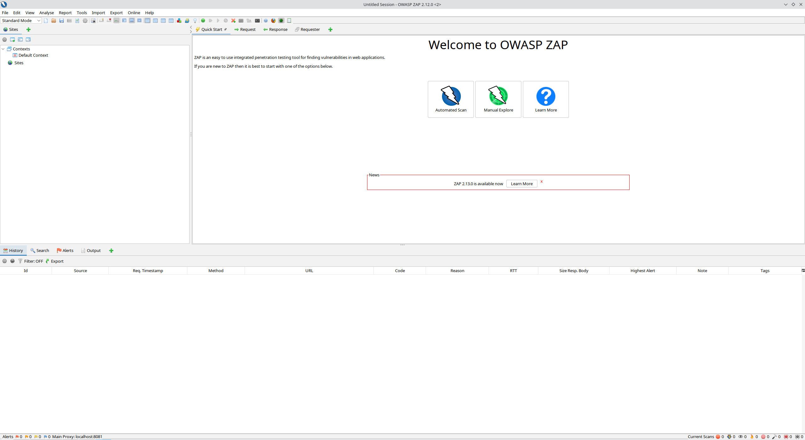
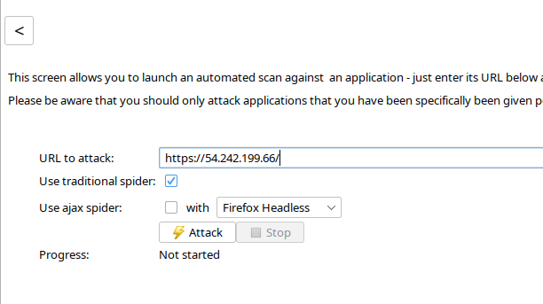
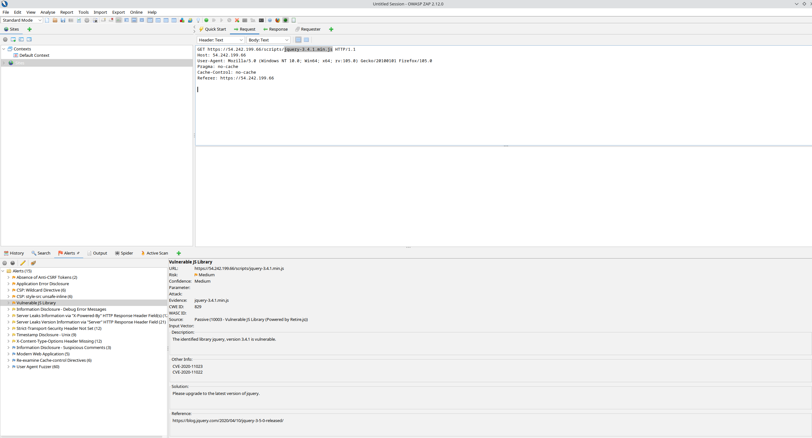
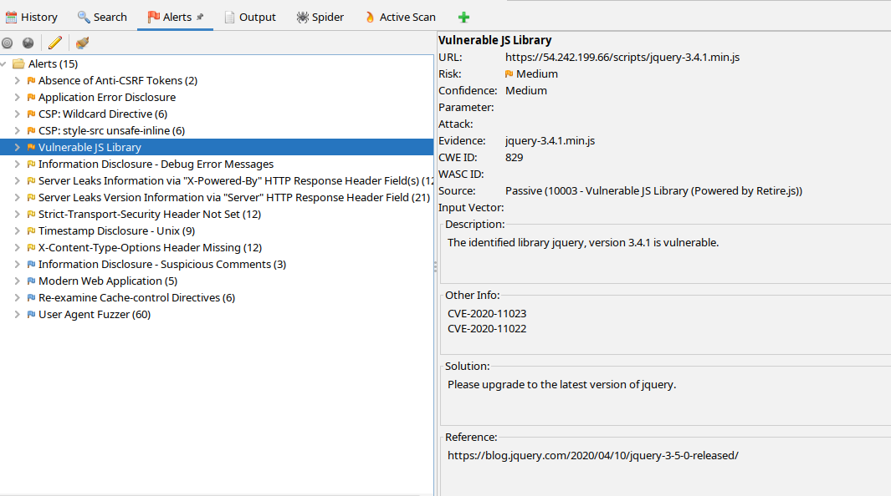
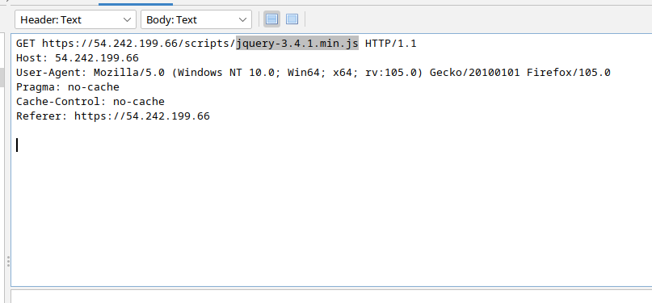

# Setup

## Installing ZAP
<!-- - Pull the ZAP docker image from dockerhub. \
    `$ docker pull softwaresecurityproject/zap-stable`

- Run a ZAP docker container. \
    `$ docker run -p 8090:8090 -i softwaresecurityproject/zap-stable zap.sh -daemon -port 8090 -host 0.0.0.0` -->

<!-- 
- owasp-zap requires at least Java 11 to run.
- Install Java 11. \
    `$ sudo apt install openjdk-11-jre-headless`

- Download the owasp-zap debian package. \
    `$ wget https://download.opensuse.org/repositories/home:/cabelo/xUbuntu_22.04/amd64/owasp-zap_2.13.0-1_amd64.deb`

- Install the package. \
    `$ dpkg -i ./owasp-zap_2.13.0-1_amd64.deb`

- Ensure owasp-zap is working. \
    `$ owasp-zap -version` -->

Currently unsure if zap should run containerized on AWS or locally. \
There *is* an official Docker image, but you need to connect to a web-app over localhost *OR* connect over internet and login with credentials which are registered from inside the web-app.

Obviously the problem here is that any connection we make to the AWS instance is not a local one so the credentials can't be set, so for now I'm doing it locally ¯\\_(ツ)_/¯

### Running ZAP on AWS (Docker way)
- Pull the ZAP docker image from dockerhub. \
    `$ docker pull softwaresecurityproject/zap-stable`

- Run the ZAP webswing UI inside a Docker container. \
    `$ docker run -u zap -p 8080:8080 -p 8090:8090 -i softwaresecurityproject/zap-stable zap-webswing.sh`

### Running ZAP on AWS (Probably the wrong way)
- Install Java 11. \
    `$ sudo apt install openjdk-11-jre-headless`

- Download the owasp-zap debian package. \
    `$ wget https://download.opensuse.org/repositories/home:/cabelo/xUbuntu_22.04/amd64/owasp-zap_2.13.0-1_amd64.deb`

- Install the package. \
    `$ dpkg -i ./owasp-zap_2.13.0-1_amd64.deb`

- Ensure owasp-zap is working. \
    `$ owasp-zap -version`

- Run the ZAP webswing UI. \
    `$ owasp-zap -daemon webswing.sh`

### Local Installation (The best way)
- On Linux, basically the same as the previous method.
- Otherwise, go here: https://www.zaproxy.org/download/.

#### Done!
- OWASP-ZAP should now be installed

### Using OWASP-ZAP for Security and Vulnerability Testing

- Click `Automated Scan`, enter the IP address of the web-app you wish to test and then click `⚡ Attack`

    

- After the scan finishes, the UI should look something like this:

    

- A list of vulnerabilities is presented in the bottom left panel. \
    Information about a vulnerability will be displayed to the right of this list after clicking one.

    

- The server response header and body are presented in the top right panel. \
    This is information the server responded with after ZAP made a specific request (shown in the bottom panel).

    In the screenshot below, ZAP made a GET request to https://54.242.199.66/scripts/jquery-3.4.1.min.js. It did this to check if a file named `jquery-3.4.1.min.js` exists in the `scripts` folder at the root level of the web-app, which it did.
    
    This is considered a vulnerability because jQuery v3.4.1 is out of date and lacks the most recent security patches. The newest version (as of 09/18/23) is v3.7.1.

    
